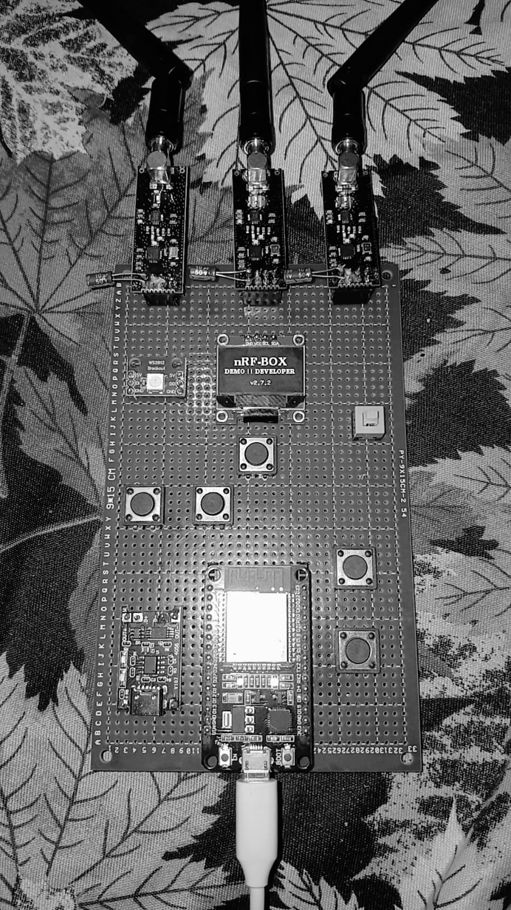
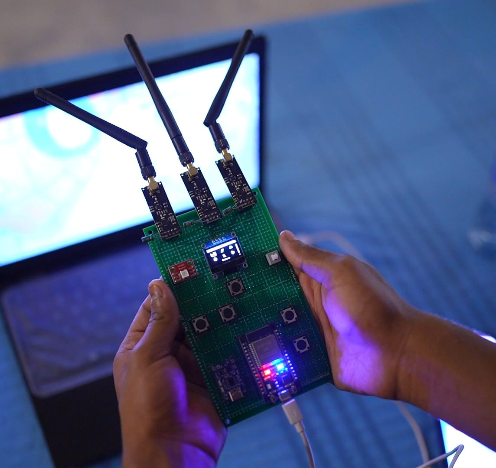

# nRF-Box_V2

                                                            DEMO || DEVELOPER

## Description

    nRFBox is a pocket-ready RF console for the curious: an ESP32 core, a crisp OLED UI, and triple nRF24L01 radios under your fingertips. Built for educational use and lab demonstrations on equipment you own.

## What you can do
- Navigate modules from the icon menu and view device status screens.
- Scan nearby BLE devices and Wi-Fi networks with RSSI and channel details.
- Visualize 2.4 GHz activity using the nRF24 analyzer view.
- Run controlled RF test modes on the nRF24 radios for lab experiments.
- Update firmware from SD and adjust device settings (brightness, NeoPixel).

<table>
    <tr>
        <td></td>
        <td></td>
    </tr>
</table>

## Highlights
- OLED icon menu with 12 modules and quick navigation
- BLE and Wi-Fi scanning views with detail pages
- Triple nRF24L01 radios with independent control
- NeoPixel status LED with toggle in Settings
- SD-based firmware update support

## Modules (menu)
- Scanner
- Analyzer
- WLAN Jammer
- Proto Kill
- BLE Jammer
- BLE Spoofer
- Sour Apple
- BLE Scan
- WiFi Scan
- Deauther
- About
- Setting

## Hardware
- ESP32 development board
- 3x nRF24L01+ modules (with antennas)
- 128x64 SSD1306 OLED (I2C)
- NeoPixel (single LED)
- 5x momentary buttons (Up, Down, Left, Right, Select)
- Optional SD card module (firmware updates)

## Controls
- Up/Down/Left/Right navigate the icon grid.
- Select opens a module; Select again returns to the main menu.
- Right button is also used for in-module actions where shown on screen.

## Build and flash
- Open [nRFBox.ino](nRFBox.ino) in Arduino IDE.
- Install the ESP32 board package.
- Install required libraries listed below.
- Select your ESP32 board and upload.

## Libraries
- U8g2
- Adafruit NeoPixel
- RF24
- ESP32 BLE (BLEDevice)
- WiFi (ESP32 core)
- SD, SPI, EEPROM, Update (ESP32 core)

## Firmware update
- Copy a file named /firmware.bin to the SD card.
- Use Settings -> Update Firmware from the device UI.

## Safety and legal
This project is for educational purposes only. It includes modules that can interfere with radio communications. Use only in controlled environments, on equipment you own, and where local laws allow it. You are responsible for compliance and safe operation.

## License
All rights reserved. This repository is shared for viewing only; no license is granted for reuse, modification, or redistribution.

## Acknowledgments
- Icons and UI are embedded in [icon.h](icon.h).
  
## Links: [Instagram](https://instagram.com/ahmed_hussain006) | [GitHub](https://github.com/ahmedhussain176)

                                                            DEMO || DEVELOPER

